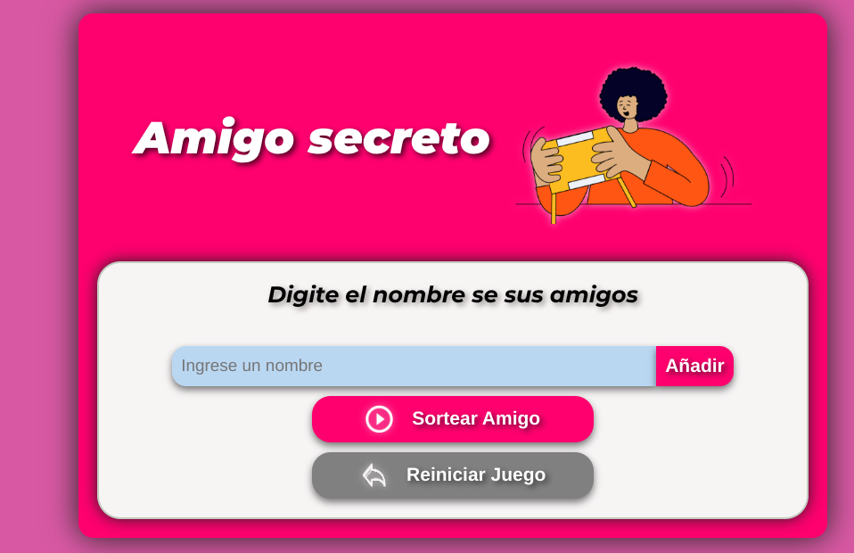

# Amigo Secreto 🎁
*AluraLatam & Oracle*

## ✨ Descripción ✨
**Amigo Secreto** es una aplicación web para organizar sorteos de amigo secreto de forma fácil y divertida. Permite agregar participantes, realizar sorteos aleatorios y ver los resultados al instante, con un diseño moderno y adaptable a móviles.

Este proyecto está hecho con **HTML**, **CSS** y **JavaScript**, y tiene como objetivo proporcionar una solución divertida y dinámica para hacer sorteos de amigos secretos.

## ✨ Funcionalidades ✨
- **Añadir Amigos**: Ingresa nombres fácilmente.
- **Sorteo aleatorio**: Asigna amigos secretos con un clic.
- **Resetear el sorteo**: Reinicia el sorteo cuando quieras.
- **Interactividad**: Botones y efectos visuales atractivos.
- **Totalmente responsivo**: Funciona en cualquier dispositivo.

## Instalación 🔧
### 1. Clona el repositorio:
```bash
git clone https://github.com/EmiBeltran96/AmigoSecreto.git
```

### 2. Abre el archivo `index.html`:
Después de clonar el repositorio, abre el archivo `index.html` en tu navegador web favorito para ver la aplicación en funcionamiento.

### 3. Link de ingreso directo a la web:
https://amigo-secreto-phi-ten.vercel.app/

## Modo de uso 📝
1. **Agregar amigos**: Ingresa los nombres de los participantes en el campo de texto y haz clic en **Añadir**.
2. **Sortear**: Haz clic en el botón **Sortear Amigo** para asignar a los amigos secretos de forma aleatoria.
3. **Ver resultados**: Los resultados del sorteo se mostrarán automáticamente en la pantalla.
4. **Resetear**: Utilice el botón **Reiniciar Juego** para iniciar un nuevo sorteo o limpiar la lista de participantes.

## Capturas de pantalla 📸

